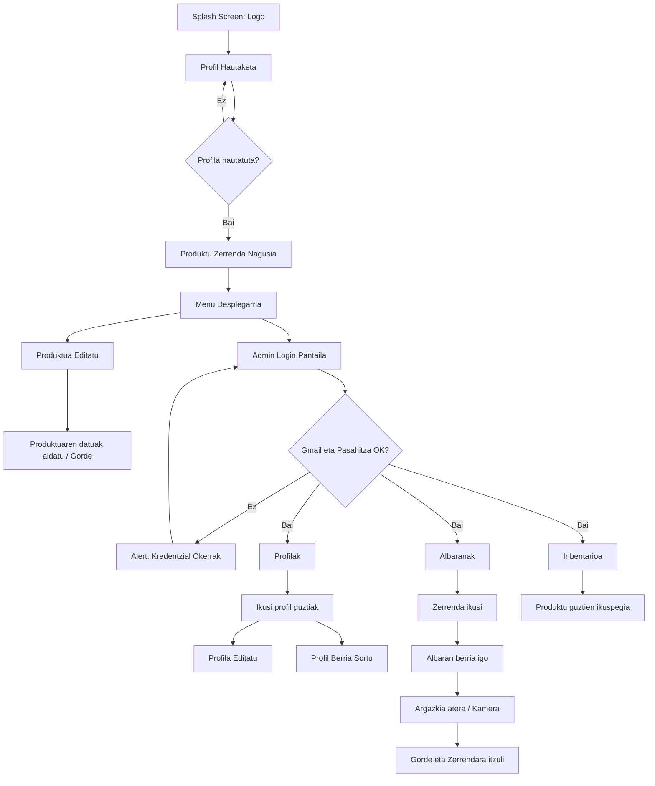

# 📦 Inbentario Kudeatzailea (Tablet Edition)

 

Enpresa txikientzako inbentarioa kudeatzeko aplikazio natiboa, Android tabletetarako optimizatua. Sistema honek produktuen kontrola, albaranen kudeaketa eta erabiltzaileen administrazioa modu intuitiboan ahalbidetzen du.

---

## 🗺️ Aplikazioaren Fluxua

Hona hemen aplikazioaren fluxu diagrama bat:

---

## 🔐 Sartzeko Fluxua eta Segurtasuna

* **Hasierako Pantaila:** Aplikazioa piztean konpainiaren logoa erakusten da karga-prozesuan.
* **Profil Hautaketa:** Erabiltzaile zerrenda bat agertuko da; profil bat hautatu arte aplikazioa blokeatuta egongo da.
* **Produktuen Zerrenda** Profila hautatuz gero, duela gutxi elkarreragin diren 10 produktuak agertuko dira.
 

> 🔑 **GARRANTZITSUA (Admin Segurtasuna)**
> Atal pribatuetara (Inbentarioa, Albaranak, Edizioa) sartzeko pasahitza beharko da. Behin sartuta, gogoratu egingo da profil aldaketa egon arte.

---

## 📋 Produktuen Zerrenda (Pantaila Nagusia)

Profila hautatu ondoren, azken 10 interakzioak erakusten dituen panela agertuko da.
* **Bilaketa Eraginkorra:** Produktuak dataren edo motaren arabera filtratu daitezke.
* **Stock Kontrol Azkarra:** Produktu bakoitzak + eta - botoiak ditu kantitatea erraz aldatzeko.
* **Alboko Menua:** Menu zabalgarri baten bidez hainbat aukera ageriko dira.
* **Alerta Bisualak:** Produktu bat gutxieneko kantitatera iristen denean, ohar bat agertuko da egoeraz ohartarazteko.

---

## 🛠️ Administrazio Moduluak
Menu zabalgarriaren bidez, hurrengo atal hauetara sar daiteke (rolaren arabera):
### 1. Produktuen Kudeaketa 🍎
* **Sorkuntza:** Argazkia (beharrezkoa), izena eta kantitatea sartu behar dira.
* **Edizioa:** Produktuaren datuak aldatu, gaitasuna kudeatu (checkbox bidez) edo produktua ezabatu daiteke (baieztapen mezurekin).
### 2. Profilen Administrazioa 👥
Erabiltzaileak egoeraren arabera ordenatuta (Gaituta > Desgaituta).
* **Datu berriak:** Izena, abizena, NANa, emaila, pasahitza eta "Admin" rola.
* **Aldaketak:** Edozein profil editatu edo ezabatu daiteke modu seguruan.
### 3. Albaranen Kontrola 📄
Sarrera eta irteeren zerrenda osoa, hiru iragazki nagusirekin:
* **Uneko hilabeteko albaranak**.
* **Uneko astekoak**.
* **Data tarte pertsonalizatua**.
### 4. Inbentario Osoa (Excel Ikuspegia) 📊
Produktu guztien zerrenda xehatua (desgaitutakoak barne):
* **Datuak:** Izena, kantitatea eta gutxieneko kopurua.
* **Iragazkiak:** Guztiak, desgaituak edo stock kritikoan daudenak.

---

## 📸 Multimedia Kudeaketa
Aplikazioak gailuko kamera erabiltzen du argazkiak ateratzeko. Irudi hauek (produktuak, profilak, albaranak) aplikazioaren barnean gorde eta bistaratzen dira kudeaketa bisualagoa egiteko.

---

## 🛠️ Erabilitako Teknologiak
* **Hizkuntza:** Kotlin.
* **Iraunkortasuna:** (adibidez: SQLite/Room) datuak eta argazkiak gordetzeko.
* **UI:** ConstraintLayout tabletetara egokitzeko diseinua.

