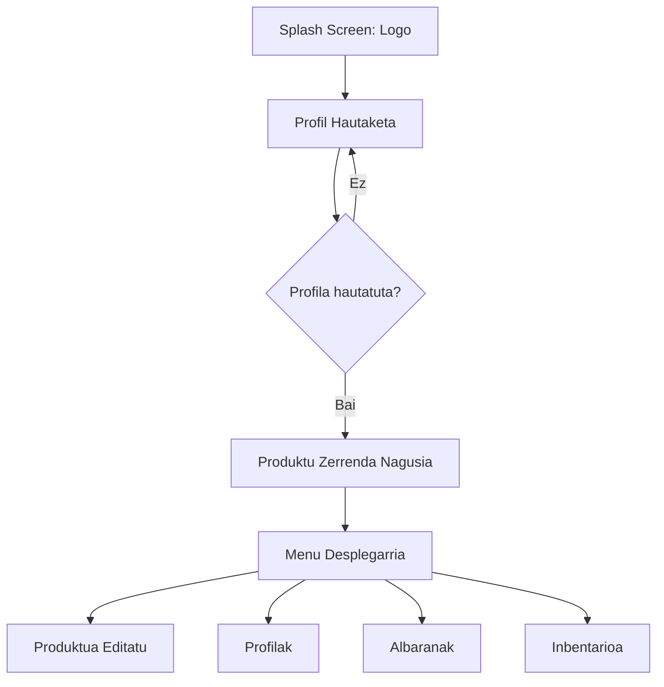

# 📦 Inbentario Kudeatzailea (Tablet Edition)

 

Enpresa txikientzako inbentarioa kudeatzeko aplikazio natiboa, Android tabletetarako optimizatua. Sistema honek produktuen kontrola, albaranen kudeaketa eta erabiltzaileen administrazioa modu intuitiboan ahalbidetzen du.

---

## 🗺️ Aplikazioaren Fluxua

Hona hemen aplikazioaren fluxu diagrama bat:

---

## 🔐 Sartzeko Fluxua eta Segurtasuna

* **Hasierako Pantaila:** Aplikazioa piztean konpainiaren logoa erakusten da karga-prozesuan.
* **Profil Hautaketa:** Erabiltzaile zerrenda bat agertuko da; profil bat hautatu arte aplikazioa blokeatuta egongo da.

> 🔑 **GARRANTZITSUA (Admin Segurtasuna)**
> Atal pribatuetara (Inbentarioa, Albaranak, Edizioa) sartzeko pasahitza beharko da. Behin sartuta, gogoratu egingo da profil aldaketa egon arte.

---
